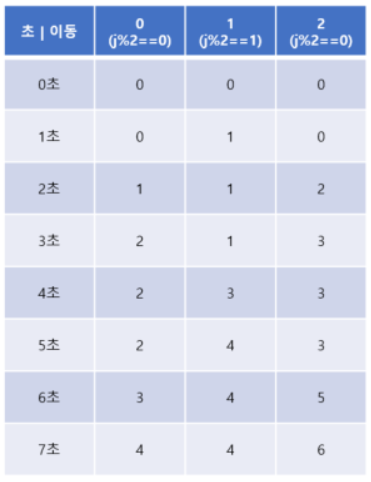

### 문제 설명

자두나무는 랜덤하게 자두를 떨어뜨린다
자두는 허공에 있을 때 잡아야하는데

자두는 T초동안 떨어지고
자두는 W번만 움직일 수 있다
움직이는 시간은 거의 0초

매초마다 어느 나무에사 자두가 떨어질지에 대한 정보가 주어졌을 때 자두가 받을 수 있는 자두의 개수

자두는 1번 자두나무 아래에 있다

### 문제 풀이

입력 예시
7 2
2
1
1
2
2
1
1
일 때

ㅁ
ㅁ
--ㅁ
--ㅁ
ㅁ
ㅁ
--ㅁ
8
이런 그림을 그릴 수 있다

~~- 떨어지는 자두가 1개일 때 1번 움직여 1개를 받아먹을 수 있다

- 떨어지는 자두가 2개일 때 2번 움직여 2개를 받아먹을 수 있다
- 떨어지는 자두가 3개일 때 2번 움직여 3개를 받아먹을 수 있다
- 떨어지는 자두가 4개일 때 2번 움직여 3개를 받아먹을 수 있다~~

2차원 테이블을 만들어 풀 수 있다

