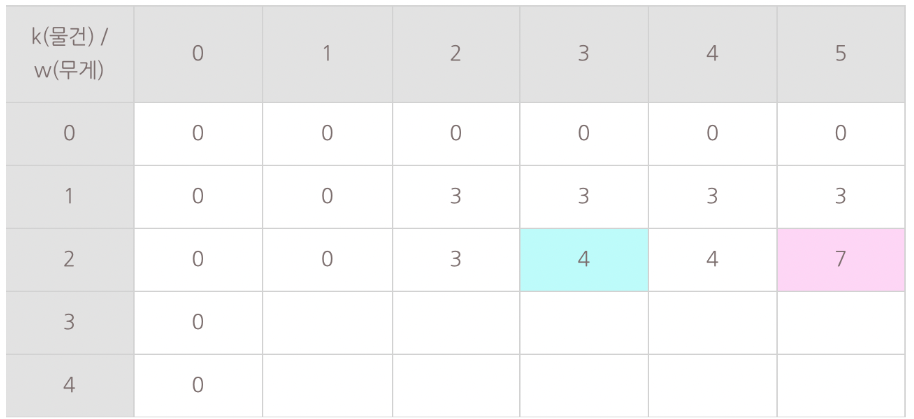

DP를 사용해서 풀어야한다
풀이를 이해못하겠다

첫번째 경우는 무조건 N을 쓰는 경우
안쓰는 경우는 구하지 않음

어렵고도 쉬운 문제..
IO문제라 불림.
물건이 들어간 경우/들어가지 않은 경우
둘을 나누어 구해야 한다
생각해보면 쉬움

코드없는 프로그래밍 냅색풀이 잘되있다

a - 3, b - 3, c - 2, d - 1
ABCD, 10 있음
ABC, 9와 ABC, 10인 경우가 나옴

D가 들어간 경우
D가 안들어간 경우

이렇게 계속 구해서 조건에 맞는 가장 큰 값을 구하면 됨
탑다운으로 구현

세로는 물건 \
0 : None \
1 : A (A만 고려)\
2 : AB (A, B만 고려)\
3 : ABC (A, B, C만 고려)\
4 : ABCD (A, B, C, D만 고려)

가로는 무게
그냥 최대무게
